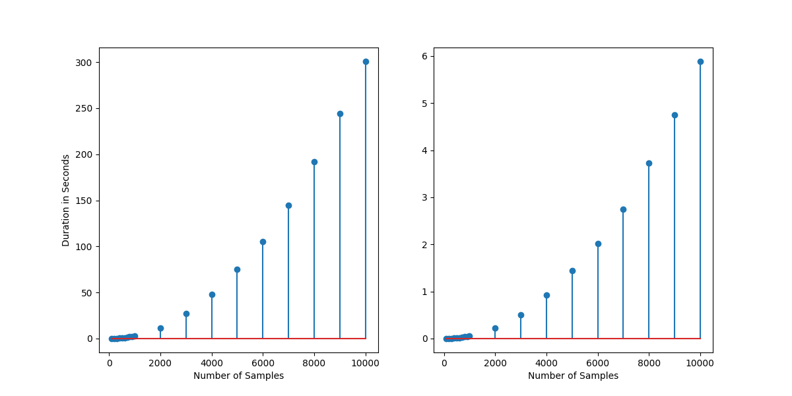

# Fourier Transform Comparisons

## Definitions

### Fourier Transform (FT)

A mathematical transformation from a function of space or itme, into a function of spatial or temporal frequency.

### Discrete Fourier Transform (DFT)

A numerical approach to apply a FT on a finite set of equally-spaced data points taken as a function of time, and converts it to a function of frequency in real and complex space.

### Fast Fourier Transform (FFT)

An algorithm that computes the DFT of a dataset faster than implementing it directly from the definition. There are multiple algorithms, each with its own advantages.

## Comparisons

In this package, I want to try a simple comparison between different methods of calculating a FT.
I think it would also be interesting to compare FFT implementations in Go and Rust because Go is optimized for parallel computation and Rust is known for its speed.

1. Implemented as a nested for loop across frequencies and number of samples. Should run at O(n^2) where n = number of samples.
2. Implemented as a matrix multiplication and dot product
3. Implementing the Fast Fourier Transform algorithm. Should run at O(n\*log(n)) where n = number of samples. (Cooley-Tukey algorithm, Prime-factor algorithm)
4. Using the numpy library

### Algorithmic Efficiency

I will collect data for the following

- CPU usage
- memory usage
- time spent calculating

### Varying Parameters

- Number of samples
- Complexity of function
  - Single frequency sine wave
  - Wave with 10 separate frequency sine waves superimposed
  - A short audio file of a song

---

# Naive Comparison

## Time Comparison of Naive implementations

The left image is the nested for loop of frequency and number of samples. The right image is using matrix multiplication and dot products from Numpy package.

The np DFT calculation is much more optimized than the simple for loops, but as expected it follows the O(n^2) trajectory.

